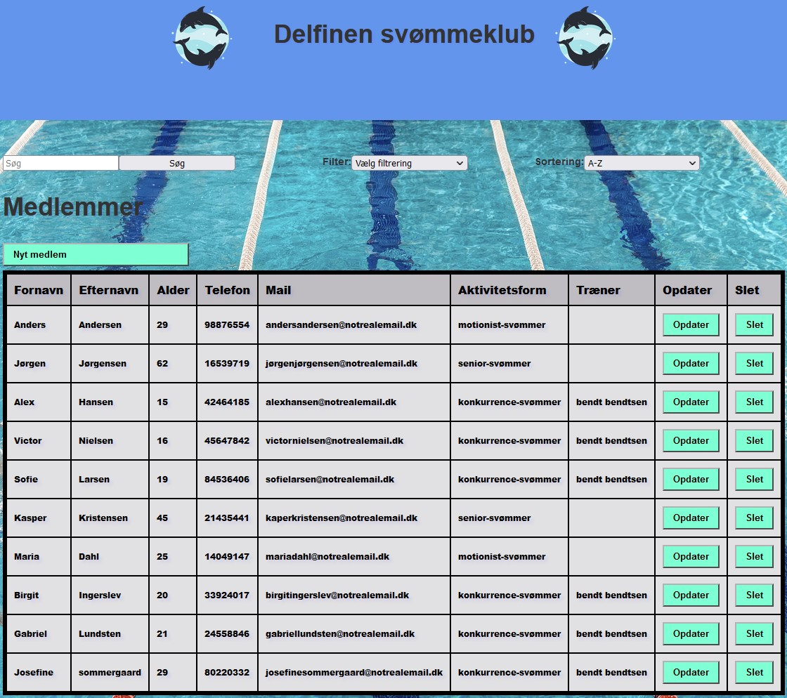

    

# Svømmeklub Delfinen

Vi har i dette projekt lavet en hjemmeside for en svømmeklubben [Delfinen](https://markusingerslev.github.io/Delfinen-svoemmeklub). Formålet for hjemmesiden er at 3 hoved figure i svømmeklubben skal kunne administrer deres respektive områder, uden for meget besvær.

De tre hoved figure er en formand, en kasser og en svømme træner. De tre person har forskellige krav til hvad de gerne vil kunne gøre på hjemmesiden.

### Userstories

#### Generelt for svømmeklubbens leadelse.

- Vi vil som administrative brugere af svømmeklubben Delfinen, for at beskytte medlemmers oplysninger, have en separat login-funktion. Denne skal være tilgængelig for formanden, kassereren og træneren. Dette ville sikrer, at kun de rigtige autoriserede personer vil får adgang til informationen om medlemmer fra svømmeklubben.

#### Forman

- Jeg vil som formand gerne have mulighed for at tilføje nye medllemer til klubben.

- Jeg vil som formand gerne kunne se informationen for klubbens medlemmer.

- Jeg vil som formand kunne opdatere oplysningerne for individuelle medlemmer.

- Jeg vil som formand gerne kunne slette et medlem fra klubben.

#### Kasser

- Jeg vil som kasserer gerne se information om klubbens medlemmer.

- Jeg vil som kasserer gerne kunne se en oversigt over, hvor meget kontingent klubben har indtjent.

- Jeg vil som kasserer gerne kunne se en liste over medlemmer, der har ubetalte kontingenter.
  - Jeg vil gerne have at for de medlemmer der ikke har betalt, at der vises hvor meget det er de ikke har fået betalt.

#### Træner

- Jeg vil som træner gerne kunne se en top 5-liste over resultaterne for hver svømmedisciplin.

- Jeg vil some træner gerne kunne tilføje en ny svømmetid for nye konkurrence-medlemmer af svømmeklubben.

- Jeg vil som træner gerne kunne tilføje et nyt resultat for en svømmekonkurrence.

- Jeg vil som træner gerne kunne tilføje nye resultater for konkurrence-svømmers nye bedste træningstider, indenfor individuelle svømme-discipliner.

## Brug af hjemmesiden

Når man først åbner hjemmesiden op, vil man blive hvis **#home** siden. Dette er en side tiltænkt som en form for velkomst. Hvis man så vælger at kører musen over **_burger menuen_** eller **_de tre horisontale streger_**, så vil man kunne se 4 nye knapper. Disse knapper fører en vider til en ny side del af siden, der omhandler deres respektive navne. Denne del af hjemmesiden er fælles for alle der åbner den op.

### Login

Oppe i det højre hjørne af hjemmesiden er der en login knap. Når man klikker på knappen vil der åbnes et dialog vindu. I dette vindu er det så muligt for formand, træner og kasser at login. Alt efter hvilken af de tre person der bliver _brugt/valgt_ som login, vil der blive vist en enten eller flere nye knapper i _burgermenuen_.

Hvis man prøver at login med et forkert login, vil der blive vist et andet vindu, der gør brugeren opmærksom på, at der er sket en fejl med deres login og at de skal prøve igen.

### Formand

Efter man så har login'et som formand, vil man kunne se tre nye knapper i _burgermenuen_. Ud over knappen **_formanden_**, så vil man også kunne se knappen **_kasseren_** og **_træneren_**. Vi har gjort det på denne måde, fordi man som formand skal have adgang til alt hvad hjemmesiden tilbyder.

Hvis man så klikker på knappen **_formanden_**, vil man bliv ført vider til siden hvor kravende for formandens userstories er opfyldt. På denne side af hjemmesiden, kan formanden, se information omkring klubbens medlemmer i en tabel. Hvis han klikker på en af de viste medlemmer vil der åbnes et detail view, der viser alle medlemmets oplysning.

Han kan i samme tabel også _ændre/opdatere_ det enkelte medlems personlige oplysning. Formanden kan også _slette/fjerne_ dem fra tabellen, ved at klikke på slet knappen, hvis nu et medlem ikke ønsker at være en del af klubben længere.

I toppen af siden er det muligt for formanden at tilføje nye medlemmer til klubben. Det er også her at han kan søge, sort eller filtrer i den viste tabel, alt efter hvad han leder efter.

### Kasser

Når man i login vælger at login som kasser, vil kun en ny knap blive vist i _burgermenuen_. Denne nye knap er **_for kasseren_**. Når man klikker på knappen vil man man blive ført vider til der opfylder kravende, som kasseren haved stillet i hans userstories.

På kasserens side, er der vist en tabel, som indeholder alle klubbens medlemmer. I kasserens tabel, vises medlemmets navn, deres alder, email, tlf., medlemskab start, medlemskab slut og om de er i restance. Grunden til at det er disse oplysninger det bliver vist, og ikke hvem personen har som træner, er at kasseren ikke har behov for alt dette.

I toppen af siden er der en oversigt over de vigtigste ting, som kasseren skal holde styr på. Han kan her se hvad forventet kontingent er for året, hvor meget er i restance, og hvor meget af kontingentet der er indbetalt. Dette er så klubben har mulighed for at lægge et budget. Der er også en checkbox som han kan check af, for at se hvilke medlemmer af klubben der indnu ikke har betalt deres kontingent. Han kan så følgende kontakte dem enten udfra de oplysning der bliver vist, eller han kan så klikke på det enkelte medlem for at få vist ydeligere information.

### Træner

Til sidst når man er login'et som træner vil man kunne se knappen **_for trænerne_** i _burgermenuen_.

Efter man har klikker på knappen vil man bliver ført vider til siden for de træner der er i klubben. Her vil de kunne se en tabel, der viser de enkelte konkurrence medlemmers tider inden for en svømme-disciplin, samt datoen for hvornår de satte tiden. Hvis en af konkurrence svømmerne sætter en ny personlig bedst inden for en disciplin, så kan trænerne opdater tiden ved at finden den gamle tid i tabellen, og trykke på opdater knappen. Der vil så åbnes en form hvor de kan skrive den nye tid ind, samt datoen den blev sat. Som standard vil datoen i opdaterings vinduet altid være den dags dato, men kan selvfølgelig ændres til en ændre dato, hvis tiden blev sat tidligere.

I toppen af siden, er der flere forskellige måder for trænerne af se tabellen. Hvis trænerne gerne vil se en liste af de 5 bedste svømme tider i alt, eller inden for en disciplin. Så skal de blot ændre **_sorting_** til **tid** og vælge en af de forskellige **discipliner**.

Lige over tabellen er der en knap, der gør det muligt for trænerne at tilføje nye resultater til _listen/tabellen_. Når en træner klikker på knappen vil de blive mødt af en form, hvor de kan oprette nye resultater. Hvis en konkurrence svømmer har været til en turnering, så vil **trænerne** kunne tilføje turneringens resultat her.

Det er også her at hvis der er en ny der melder sig ind i klubben, som konkurrence svømmer, at trænerne kan tilføje trænings resultater

